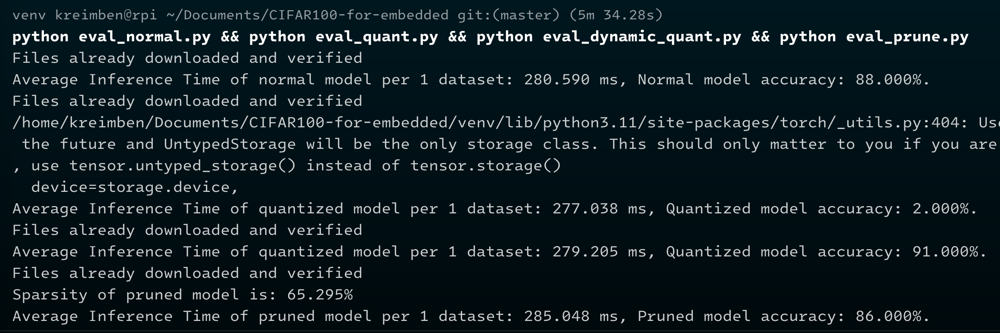

# Deep Learning Model Optimization for Embedded Systems

## Introduction:
This project delved into the complexities of optimizing a computationally demanding deep learning model (ResNet50) for embedded systems (Raspberry Pi).
I used many optimization techniques like static and dynamic quantization, along with pruning, to explore potential reductions in model size and inference time.
While this techniques did not works in this case,
This README.md explores the journey of optimizing a ResNet50 model for CIFAR-100 image classification on Raspberry Pi.

## Project Overview:
The original goal was to optimize a ResNet50 model trained on the CIFAR-100 dataset for deployment on embedded systems like Raspberry Pi.
This project utilized PyTorch, torchvision, static quantization (post-training quantization), dynamic quantization and pruning to the model.
The primary objective was to achieve **performance improvements and efficiency gains on the embedded system.**

## Challenges Encountered:
Despite the initial inceptions, the optimization techniques applied to the ResNet50 model did not work the desired results on the Raspberry Pi.

The following challenges were encountered:
### Static Quantization:
Post-training quantization was applied to reduce the model's memory footprint and potentially speed up inference.
However, the quantized model suffered from significant accuracy drop, achieving only 2% accuracy compared to the original model's 88% accuracy.
This indicates that the quantization process introduced substantial information loss, rendering the model ineffective for actual use.

### Dynamic Quantization:
Dynamic quantization was explored as an alternative to static quantization which generally has lower performance for accuracy than static quantization.
Although the dynamically quantized model maintained a higher accuracy of 91%,
it shows almost no different at inference timing in raspberry pi compared to original model (279.205 ms vs. 280.590 ms per dataset).

### Pruning:
Pruning techniques were applied to remove redundant and less important weights from the model, reducing its size and computational requirements.
The pruned model achieved a sparsity of 65.295%, indicating a substantial reduction in the number of non-zero parameters.
However, the pruned model's accuracy dropped to 86%, and the inference time per dataset increased slightly to 285.048 ms, contrary to the expected performance gains.

## Lessons Learned:
The project's challenges highlight several important lessons for optimizing deep learning models for embedded systems:
* Aggressive quantization or pruning can lead to significant accuracy degradation, as observed in the static quantization case.
* It is crucial to carefully balance these trade-offs and find the right level of optimization that maintains acceptable accuracy while improving efficiency.
* ResNet50 and CIFAR100 was too high aimed goal for raspberry pi.

It may be necessary to explore different quantization and pruning strategies, as well as hyperparameter tuning, to find the optimal configuration for the target device.

Hardware limitations: The performance gains achieved through optimization techniques can be limited by the hardware constraints of the target device.
Raspberry Pi, with its limited computational resources (CPU: BCM2835 (4) @ 1.400GHz / Memory: 909MiB), may not be able to fully leverage the benefits of certain optimization techniques.
It is important to consider the hardware capabilities and limitations when setting expectations for performance improvements.

## Key Learnings and Insights:
### Quantization:
The quantization is converting model's FP32 values to int8 or int4
There are three types of quantization.
The first is dynamic quantization which is easiest and simpliest way to adjust it to model.
Dymanic quantization only convert model's weights so may not show big improvments.
The second is static quantization which is also called post training quantization.
PTQ convert weights and activation to integer and activated during the calibration.
If use fusion, the model can procees the input in parallel.
The third is quantization aware training.
QAT quantize by learning the weights and activation.
Locating fake quantization layer also doing clamping and rounding.
QAT is known for better performance compared to dynamic quantization and static quantization.

### Pruning:
The model pruning is elinimating less important informations.

By doing pruning, Inference speed is expected to be increased because number of parameters are decreased.
The main difference between dropout and pruning is storing the reduced nodes.
Dropout stored every nodes and randomly eliminate by every time.
But the pruning never store deleted nodes.

